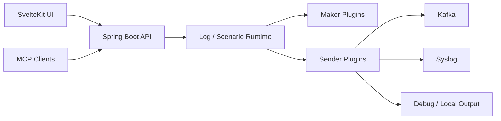

# LogMaker

[](https://openjdk.org/projects/jdk/17/)
[](https://spring.io/projects/spring-boot)
[](https://svelte.dev/)
[](./LICENSE)

LogMaker is a plugin-based log simulation platform for generating, routing, and orchestrating synthetic logs. Use the web UI to create data with Makers, compose messages with Log templates, and deliver output through Senders such as Kafka, Syslog, or Debug.

## Highlights

- **Visual log builder**: Combine `<maker_name>` tokens into log formats and verify output with live preview.
- **Scenario orchestration**: Run multiple Logs in sequence with per-step Senders and field overrides.
- **Shared variables**: Reuse generated Maker values across a Scenario to model correlated flows such as login, activity, and logout.
- **Plugin architecture**: Extend Maker and Sender types with PF4J-based JAR plugins.
- **MCP automation**: Automate dashboard checks, import/export, plugin installation, and scenario creation through the MCP server and Codex Skill.
- **Operational UI**: Monitor dashboards, start/stop workloads, inspect EPS/BPS, import/export definitions, and use responsive dark-mode screens.

## Core Concepts

| Concept | Description |
| --- | --- |
| Maker | Data source that emits values such as IP, Date, Regex, UUID, or Pick |
| Sender | Delivery target that sends generated logs to Debug, Syslog, Kafka, or custom outputs |
| Log | Template and rate definition built from Maker tokens and static text |
| Scenario | Ordered workflow that executes multiple Log steps |
| Override | Step-level replacement of a Log field with a literal value or shared variable |
| Plugin | PF4J JAR that provides new Maker or Sender types |

## Architecture

```text
logmaker/
├── core/              # Spring Boot API, runtime services, static UI hosting
├── plugin-api/        # Maker/Sender plugin contracts
├── default-plugin/    # Built-in makers and senders
├── ui/                # SvelteKit frontend, built into core static resources
├── mcp-server/        # MCP server for automation clients
├── helm/              # Helm chart
└── k8s/               # Kubernetes manifests
```



### Runtime Model

- Core stores Maker, Sender, Log, and Scenario definitions as JSON.
- Logs run through managed threads and can be paused or resumed without deleting configuration.
- Scenarios route delivery through each step's `senders`; legacy scenario-level senders are ignored.
- Velocity templates are executed with `SecureUberspector` hardening for safer template evaluation.
- Import/export endpoints use the same JSON shapes as the UI.

## Quick Start

### Requirements

- Java 17+
- Maven 3.x, or the included `./mvnw`
- Node.js 18+

### Build and Run

```bash
git clone https://github.com/m8928/logmaker.git
cd logmaker

cd ui
npm install
npm run build
cd ..

./mvnw clean package
java -jar core/target/logmaker-core-3.0.0.jar
```

Open [http://localhost:19999](http://localhost:19999).

### Development Mode

Run the backend:

```bash
./mvnw spring-boot:run -pl core
```

Run the frontend with Vite proxying `/api/v1` to `127.0.0.1:19999`:

```bash
cd ui
npm install
npm run dev
```

Open [http://localhost:5173](http://localhost:5173).

## MCP Server

The MCP server exposes LogMaker operations to MCP-compatible clients. It supports dashboard reads, Maker/Sender/Log/Scenario CRUD, import/export, plugin install/delete, log preview, and start/stop operations.

```bash
cd mcp-server
npm install
npm run build
LOGMAKER_URL=http://localhost:19999 npm start
```

Example Claude Code registration from the repository root:

```bash
claude mcp add logmaker \
  -e LOGMAKER_URL=http://localhost:19999 \
  -- node "$PWD/mcp-server/dist/index.js"
```

This repository also includes a project-local Codex Skill at `.codex/skills/logmaker` with LogMaker-specific MCP usage guidance.

## API

Swagger UI is available after starting the backend:

- [http://localhost:19999/swagger-ui.html](http://localhost:19999/swagger-ui.html)

| Endpoint | Method | Description |
| --- | --- | --- |
| `/api/v1/dashboard` | GET | Dashboard metrics |
| `/api/v1/maker` | GET/POST | List or create Makers |
| `/api/v1/maker/{name}` | PUT/DELETE | Update or delete a Maker |
| `/api/v1/maker:import` | POST | Import Maker JSON |
| `/api/v1/maker:import-file` | POST | Import Maker JSON file |
| `/api/v1/sender` | GET/POST | List or create Senders |
| `/api/v1/sender/{name}` | PUT/DELETE | Update or delete a Sender |
| `/api/v1/sender:import` | POST | Import Sender JSON |
| `/api/v1/sender:import-file` | POST | Import Sender JSON file |
| `/api/v1/log` | GET/POST | List or create Logs |
| `/api/v1/log/{name}` | PUT/DELETE | Update or delete a Log |
| `/api/v1/log/{name}:start` | POST | Resume a Log |
| `/api/v1/log/{name}:stop` | POST | Pause a Log |
| `/api/v1/log:preview` | POST | Preview Log output |
| `/api/v1/log:import` | POST | Import Log JSON |
| `/api/v1/log:import-file` | POST | Import Log JSON file |
| `/api/v1/plugin` | GET/POST | List or upload Plugins |
| `/api/v1/plugin/maker` | GET | List available Maker types |
| `/api/v1/plugin/sender` | GET | List available Sender types |
| `/api/v1/plugin/{name}` | DELETE | Delete a Plugin |
| `/api/v1/scenario` | GET/POST | List or create Scenarios |
| `/api/v1/scenario/{name}` | PUT/DELETE | Update or delete a Scenario |
| `/api/v1/scenario/{name}:start` | POST | Start a Scenario |
| `/api/v1/scenario/{name}:stop` | POST | Stop a Scenario |

## Testing

```bash
# Backend and plugin tests
./mvnw test

# Frontend type and build checks
cd ui
npm run check
npm run build

# MCP server build
cd ../mcp-server
npm run build
```

Some plugin tests use Mockito agent attachment and UDP sockets. In restricted sandboxes, run Maven tests with permissions that allow Java agent attach and local socket creation.

## Plugin Development

Custom plugin development starts from `plugin-api`, which defines Maker/Sender contracts. The built-in `default-plugin` is the best reference implementation.

See [plugin.md](./plugin.md) for the plugin development guide.

## Deployment

Deployment assets are included for container and Kubernetes environments:

- [Dockerfile](./Dockerfile)
- [k8s](./k8s)
- [helm/logmaker](./helm/logmaker)

## License

LogMaker is licensed under the [Apache License 2.0](./LICENSE).
